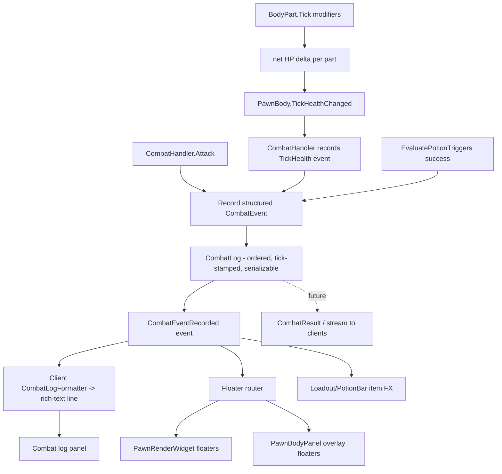

## Combat Screen UX Overhaul

Four workstreams. Workstream 0 replaces the parallel string/event channels with a single **structured, serializable combat-event log recorded in the sim** - the authoritative source of truth that will transmit cleanly once combat runs server-side. Workstreams A-C render from that log. Today `CombatScreen` is the only consumer and combat runs locally; the server (`Wendlewind.Server`) is still a stub (`/matches` returns a placeholder `CombatResult`) heading toward seeded, deterministic, server-authoritative sim (`CombatReplay.AssertDeterministic`). Per the chosen scope we build the serializable model + in-sim recording now and **defer network transport/endpoints** until networking lands, keeping the types transport-ready.

### Current state (key facts)
- `CombatScreen` subscribes to **two parallel channels**: `EventOccured` (thin `CombatEvent`) -> `PrintDamage` (portrait floaters only) and `CombatLogMessageAdded` (formatted `string`) -> log. See [CombatScreen.cs](Wendlewind/Source/Scenes/MainGameScene/Gui/CombatGui/CombatScreen.cs) lines 30-32, 214-270.
- The duplication lives in `CombatHandler.LogDamage` ([CombatHandler.cs](Wendlewind.Simulation/Source/Sim/Combat/CombatHandler.cs) lines 152-220): one method both `yield`s rich-text log strings **and** side-effect-emits `CombatEvent`s. `CombatEvent` is so thin the UI re-parses digits out of the formatted `Text` to size fonts (`PrintDamage` lines 239-247).
- Floaters render only on the **portrait** (`PawnRenderWidget` -> `BodyPartDamageTextRenderer`), never on the **parts tree** (`PawnBodyPanel`).
- Parts tree ([PawnBodyPanel.cs](Wendlewind/Source/Scenes/MainGameScene/Gui/Widgets/EntityWidgets/PawnWidgets/PawnBodyPanelWidgets/PawnBodyPanel.cs)) just polls colors/pips each frame; `_socketPanels` holds one row per part.
- Combat `PotionBar` gets **no click handler** ([PawnCombatPanel.cs](Wendlewind/Source/Scenes/MainGameScene/Gui/Widgets/CombatWidgets/PawnCombatPanel.cs) line 44); potions are display-only.
- `Heal` and `Death` `CombatEventType`s exist but the sim never emits them. Per-tick DoT/regen changes `BodyPart.HitPoints` silently (only `HealthChanged`). Potion triggers only write a log string ([CombatHandler.cs](Wendlewind.Simulation/Source/Sim/Combat/CombatHandler.cs) lines 239-275).

### Event flow after changes (single structured, recorded log)

---

### Workstream 0 - Structured, server-authoritative combat log (foundational)
Replace the two parallel channels with one serializable event model recorded in the sim; keep all presentation (text + colors + visuals) on the client, derived from the recorded data.

- Add a serializable event model in the sim (`Wendlewind.Simulation/Source/Sim/Combat/`, e.g. `CombatLogEvent.cs`) as **plain records with no engine/live-object references** so they can later move to / be shipped via NetCode:
  - Discriminated by a `CombatEventKind` enum (`Damage`, `Block`, `Miss`, `Dodge`, `Heal`, `DamageOverTime`, `BuffApplied`, `DebuffApplied`, `PartSevered`, `PartDestroyed`, `EquipmentDestroyed`, `StatusReflected`, `PotionUsed`, `Death`, `System`).
  - Key entities by stable ID + denormalized display fields: `Tick`, `SubjectPawnId` (`Entity.Id`) + `SubjectName`, optional `SourcePawnId`/`SourceName`, optional `ItemMoniker`/`ItemLabel`, optional `BodyPartKey` (`BodyPart.InternalLabel`, already used for layout lookups) + `BodyPartLabel`, `Amount`, `Blocked`, `DamageType`, `IsCritical`, and a nested `CombatSubEffect[]` for the per-part modifiers/severs/reflected effects a single hit produces.
  - **No `Color`/MonoGame types** in the model - the client maps `CombatEventKind`/`DamageType` to colors/fonts (fixes today's split where `CombatEvent` had no color but `PrintDamage` picked it).
- `CombatHandler` owns the authoritative log: `public IReadOnlyList<CombatLogEvent> Log`, a private `Record(CombatLogEvent)` that stamps `_encounter.Ticks`, appends, and raises a single `event Action<CombatLogEvent>? CombatEventRecorded`. Remove `EventOccured` and `CombatLogMessageAdded`.
- Strip rich-text string building out of the sim: `LogDamage`/`OnDeath`/`LogMessage` stop composing `/c[...]` strings and instead `Record(...)` structured events. One `Damage` event per `DamageRecord` carries its `CombatSubEffect[]`, so a hit is one ordered entry (drops the `logs.Reverse()` trick, lines 145-149) and its grouped log block is rebuilt client-side.
- New client-side `CombatLogFormatter` pattern-matches `CombatLogEvent` -> rich-text line(s), reproducing today's colors, sub-bullets, and grouping from the denormalized fields.
- `CombatScreen` subscribes once to `CombatEventRecorded` and fans out to (a) `CombatLogFormatter` -> log panel, (b) floater router (portrait + parts panel), (c) loadout item FX - replacing the dual subscription (lines 30-32). Floaters resolve `BodyPartKey`/`InternalLabel` to the live part/widget locally.
- Determinism bonus: because the log is authoritative and deterministic, `CombatReplay` can later diff two runs' `CombatLog` for a stronger check than the current `Result` summary. (Note only; not wired now.)
- Deferred (not this iteration): server `/matches` producing the log, attaching it to `CombatResult`, and client replay. Keep the model JSON-friendly (source-gen-compatible records) so this is a later add, not a rewrite.

---

### Workstream A - Inspectable, prominent combat loadout (goal 1)
Keep it to the combat loadout (equipped potions/weapons/stance + combat trinkets), just made prominent and inspectable.
- In [PawnCombatPanel.cs](Wendlewind/Source/Scenes/MainGameScene/Gui/Widgets/CombatWidgets/PawnCombatPanel.cs) `GeneratePlayerControls`: pass a click handler to `PotionBar` -> `_gui.ViewEntity(potion)` (currently none). `PotionBar` already forwards `clickHandler` ([PotionBar.cs](Wendlewind/Source/Scenes/MainGameScene/Gui/Widgets/CombatWidgets/PotionBar.cs) line 18).
- Add tooltips to each potion icon describing its trigger condition via `PotionTrigger.Describe()` so the player sees when it will fire.
- Wrap the loadout `VerticalStackPanel` (potion/weapon/stance/trinket bars) in a titled framed panel (`Stylesheet.Current.Atlas` panel frame) for a clearer "Loadout" grouping.
- Confirm weapon/trinket icons are also click-inspectable (mirror the potion handler).

### Workstream B - Item-trigger visual indicator (goal 2)
- Sim: in `CombatHandler.EvaluatePotionTriggers` ([CombatHandler.cs](Wendlewind.Simulation/Source/Sim/Combat/CombatHandler.cs) line 253) after `result.Success`, `Record` a `PotionUsed` `CombatLogEvent` (carrying `ItemMoniker`/`ItemLabel` + `SubjectPawnId`) before `potion.Destroy()`.
- UI: `PotionBar` (and the loadout frame) listens for the `PotionUsed` event and plays a short icon flash/glow + a "consumed" floater near the pawn portrait, then removes the icon (existing `Update` already drops destroyed potions). Add a brief highlight pulse so a fired potion is unmistakable.
- Floater router emits a name floater (e.g. "Jar of Blood!") over the user, styled via the `PotionUsed` kind.

### Workstream C - Richer per-part combat visualizations (goal 3)
Emit heals + per-tick DoT/regen, then render floaters on **both** the parts tree and the portrait, plus a hit/heal flash on affected rows.

Sim (make ticks visible):
- In [BodyPart.cs](Wendlewind.Simulation/Source/Sim/Entities/Pawns/BodyPart.cs) `Tick()` (lines 265-284): capture `_hitPoints` before/after the modifier loop; if net delta != 0, bubble it up (new `PawnBody`-level event `TickHealthChanged(BodyPart, double delta)`). This cleanly separates DoT/regen from attack damage (attacks flow through `ApplyDamage`, not `Tick`).
- `CombatHandler` subscribes to both pawns' `PawnBody.TickHealthChanged` (wire alongside existing `DamageTaken` hookups in the ctor, lines 54-61) and `Record`s a `Heal` (delta > 0) or `DamageOverTime` (delta < 0) `CombatLogEvent` with `BodyPartKey` + `Amount`. The client renders positive as a green heal number, negative as DoT.
- Potion heals (e.g. Jar of Blood / regen potions) surface through the same tick delta path, so healing shows numbers without special-casing each handler.

UI (render floaters + flashes):
- New parts-panel overlay: a custom-rendered layer over `PawnBodyPanel` that, given a `BodyPart`, finds the matching row in `_socketPanels` and spawns floating text at that row's `ActualBounds` (reuse the animation logic from [BodyPartDamageText.cs](Wendlewind/Source/Scenes/MainGameScene/Gui/Widgets/PawnRenderer/BodyPartDamageText.cs)). Add an `AddDamageText(bodyPart, ...)` entry point on `PawnBodyPanel`.
- The floater router (Workstream 0) fans each event to `_pawnBodyView`/`_enemyPawnBodyView` **and** the portrait so floaters appear in both places, per the chosen "both" behavior.
- Aggregation: DoT/regen fire up to 60x/sec. Accumulate per-part deltas and emit at most ~2 floaters/sec per part (threshold + timer) in the floater layer to avoid spam. Attack floaters remain immediate.
- Add a brief color flash/scale-pulse on the affected `BodyPartRow`/`BodyPartIcon` when a part takes damage or is healed (drives the eye to the row emitting the number).
- Floater/log styling for the new event types: heal = green, DoT = poison/purple-red, smaller font than direct hits (moved from `PrintDamage`'s switch into the shared router/formatter).

### Notes / decisions
- Server-authoritative-ready: the combat log is a structured, serializable, ID/moniker-keyed record recorded in the sim (the future server), with all text/color/visual presentation derived client-side. Transport is deferred but the model is built transport-ready.
- No NetCode contract changes this iteration; `CombatScreen` is the sole consumer today, so the Workstream 0 refactor is safe.
- The `CombatLogFormatter` moves rich-text presentation from the sim to the client, keeping `CombatHandler` focused on recording structured events.
- Enemy parts tree already exists (`_enemyPawnBodyView`), so both pawns get the same treatment automatically.
- Reuse existing `BodyPartDamageText` animation (float up, fade, vibrate) rather than adding a tween library.
</plan>
<parameter name="todos">[{"id": "event-model", "content": "Workstream 0: add serializable CombatLogEvent model (CombatEventKind + ID/moniker-keyed denormalized fields + CombatSubEffect[], no MonoGame types) in Wendlewind.Simulation/Sim/Combat"}, {"id": "combatlog-record", "content": "Make CombatHandler own the authoritative CombatLog: Record() stamps tick + appends + raises single CombatEventRecorded; remove EventOccured + CombatLogMessageAdded; convert LogDamage/OnDeath/LogMessage to record structured events (no /c[] strings)"}, {"id": "log-formatter", "content": "Add client-side CombatLogFormatter that renders each CombatLogEvent to rich-text log lines (colors/bullets/grouping); CombatScreen subscribes once and fans to log + floater router + item FX"}, {"id": "loadout", "content": "Make combat loadout prominent + inspectable: pass ViewEntity click handler to PotionBar in PawnCombatPanel, add trigger tooltips (PotionTrigger.Describe), wrap in titled frame, ensure weapon/trinket icons inspectable"}, {"id": "sim-heal-dot", "content": "Emit per-tick DoT/regen: capture net HP delta in BodyPart.Tick, bubble via PawnBody.TickHealthChanged, Record Heal/DamageOverTime CombatLogEvents from CombatHandler"}, {"id": "sim-potion-event", "content": "Record a PotionUsed CombatLogEvent (ItemMoniker/Label + subject) in CombatHandler.EvaluatePotionTriggers on successful trigger"}, {"id": "parts-floater-layer", "content": "Add a custom floater overlay for PawnBodyPanel that resolves BodyPartKey/InternalLabel to the matching part row (reuse BodyPartDamageText animation) with AddDamageText entry point"}, {"id": "route-events", "content": "Build the floater router that fans each CombatLogEvent to both parts panels and the portrait, mapping kind/DamageType to color/font client-side (heal/DoT/potion)"}, {"id": "aggregation", "content": "Aggregate per-part DoT/regen ticks (threshold + ~2/sec cap) so floaters don't spam; keep attack floaters immediate"}, {"id": "part-flash", "content": "Add brief flash/scale-pulse on BodyPartRow/BodyPartIcon when a part takes damage or is healed"}, {"id": "potion-fx", "content": "Add icon flash/glow + consumed floater in PotionBar/loadout when a potion triggers, driven by the PotionUsed event"}]