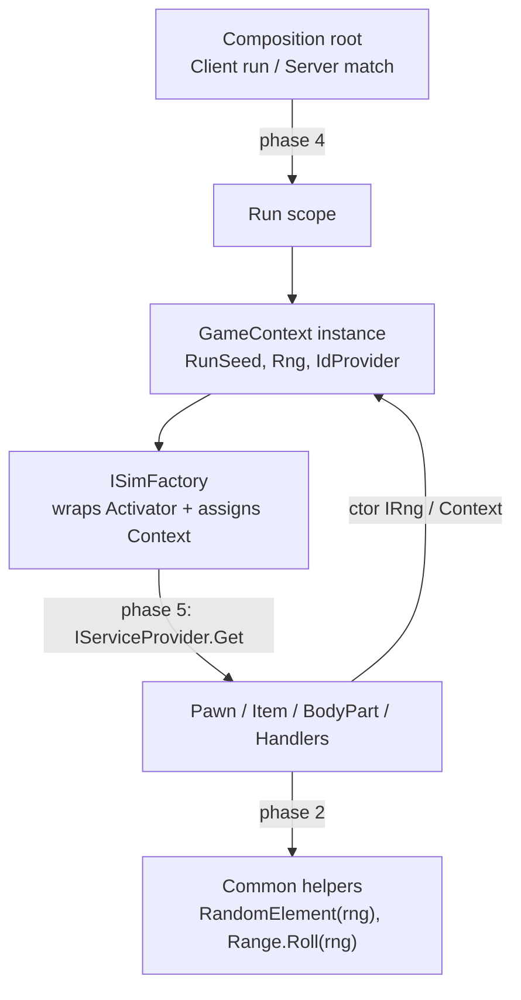

# RNG / GameContext / DI Conversion Plan (1→2→3→4→5)

Staged removal of the sim statics (`GameContext.Random`, `Rng.Current`, `GameContext.Current`)
in favor of instance-owned context, explicit rolls, and a run-scoped DI container that
constructs the sim graph — including XML-driven handlers and Scribe load.

Each phase ships on its own and keeps the game + replay working. Phases 1→3 remove the statics;
phase 4 adds the container at the composition root; phase 5 replaces remaining `Activator`
construction with container resolution and constructor-injects `IRng` into handlers.

Guardrail throughout: run `CombatReplay.AssertDeterministic()` after every batch, plus a save/load
round-trip check once phase 3 (and again phase 5) touches `Scribe`.

---

## Target ownership



- End of phase 2: static `GameContext.Random` / `Rng.Current` gone.
- End of phase 3: static `GameContext.Current` gone.
- Phase 4: container appears, wraps the run; `ISimFactory` still uses `Activator`.
- Phase 5: factory and Scribe resolve handlers through the container; `IRng` is ctor-injected.

---

## Phase 1 — Collapse the RNG facade (0.5 day, low risk)

Goal: one name for the sim stream, delete the duplicate static setter path. No behavior change.

- Remove `GameContext.Random` (static) and route the ~30 call sites to `GameContext.Current.Rng`
  via a mechanical rename. Sites live in `CombatHandler`, `Pawn`, `BodyPart`, `BodyPartExtensions`,
  `PawnGenerator`, `Item`, `DamageRequest`, `Damage`, the modifier/body/trinket handlers, and
  `CombatGenerator`.
- Keep `Rng.Current` for now (Common still needs it) but make `GameContext.Rng`'s setter the only writer.
- `Core.Random` forwards to `GameContext.Current.Rng`.

Acceptance: solution builds; `CombatReplay.AssertDeterministic()` still agrees.

Cosmetic on purpose — removes the "two ways to set the stream" smell before the real work.

---

## Phase 2 — Thread `Random` into Common helpers (1–2 days, medium risk)

Goal: nothing in `Wendlemire.Common` reads a hidden global. This phase makes rolls explicit.

Change parameterless random surfaces to take a `Random`:

- `CollectionExtensions`: `RandomElement`, `InRandomOrder`, `RandomElementByWeight` gain a `Random rng` param.
- `RangeInt` / `RangeFloat` / `RangeDouble`: replace `RandomValue` (reads `Rng.Current`) with
  `Roll(Random rng)`. Keep `RandomValue` as `[Obsolete]` shim during migration, then delete.
- `DefRepository.RandomElement()` takes a `Random`.

Then update every sim caller to pass `context.Rng`. Tricky ones are readonly-struct fields like
`PoisonHandler.DamageFactorPerTick.RandomValue` → `DamageFactorPerTick.Roll(context.Rng)`.

Temporary bridge: `Rng.Current` still exists so the Renderer's `SpriteSheet` and any missed site
compile. Presentation stays on `Rng.Visual`.

Risk: this is where determinism bugs hide. The replay assertion is the guard — run after each file batch.

Acceptance: `Wendlemire.Common` has zero `Rng.Current` reads; replay agrees.

---

## Phase 3 — Pass `GameContext` down through the tick (3–5 days, higher risk)

Goal: delete the static `GameContext.Current`. Sim objects hold the context they already use.

### 3a. Call graph
`GameContext.Tick` → `Pawn.Tick` / `CurrentZone.Tick` → `Encounter.Tick` → `CombatHandler.Tick`.
Give long-lived objects a `Context` reference set at creation:

- `Pawn`, `BodyPart`, `Item`, `BodyPartModifier`, `Zone`, `Encounter`, `CombatHandler` get a
  `GameContext Context` field.
- Replace the ~35 `GameContext.Current.X` reads (Achievements, `IdProvider`, `Player`, `CurrentZone`,
  `World`, `Ticks`) with `Context.X`.

### 3b. Activator factories (the hard part)
These construct sim objects from XML `HandlerClass`/`EntityClass` and cannot receive a ctor arg today:

- `EntityGenerator` `Activator.CreateInstance(def.EntityClass)`
- `BodyPartModifier` generator
- `Item.Initialize` — 5 handler kinds (Enchantment / Trinket / Equipment / Potion / Weapon)
- `BodyDef.Handler`/`Generator`, `AchievementDef`, the `*Properties.CreateHandler()` helpers

Strategy: introduce `ISimFactory` (or `context.Create<T>(def)`) that does the `Activator` call **and**
assigns `.Context`. Handlers already have a post-construct field seam (`TrinketHandler.Trinket = this`),
so context assignment slots into the same place. Make `EntityGenerator` / `BodyPartModifierGenerator`
instance methods on the factory instead of statics.

Save/load: `DirectXmlToObject` also `Activator`s objects during `Scribe` load — those need the same
context back-fill after load (a `Rebind(context)` pass over the loaded graph, or set `Context` in the
`IExposable` wire-up).

`GameContext.Current` becomes a compatibility shim (still set, marked obsolete) until every reader is
converted, then deleted.

Risk: highest — touches ~40 files and the save path. Ship behind the replay assertion plus a manual
"boot a run, fight, save, load, fight again" check.

Acceptance: no `GameContext.Current` references outside the shim; replay agrees; save/load round-trips a fight.

---

## Phase 4 — Container at the composition root only (1–2 days on top of 1–3, low risk)

Goal: real lifetimes for runs/matches. Worth it because the Server hosts concurrent matches.

- Add `Microsoft.Extensions.DependencyInjection` to `Wendlemire.Server` and the Client boot
  (`Core` / `GameScene`).
- Register `GameContext`, `ISimFactory`, `IRng`/seed source as **scoped**. One `CreateScope()` per run
  (client) or per `POST /matches` (server).
- The sim graph is still built by `ISimFactory` inside the scope (via `Activator` + field assign).
  The container only resolves the root `GameContext` and its collaborators. Phase 5 replaces that
  `Activator` path.

Acceptance: Server runs two matches in two scopes with independent seeds in one process; each is
internally deterministic; client run still boots and fights.

---

## Phase 5 — Container-resolve handlers and rewrite Scribe construction (1–2 weeks, high risk)

Goal: constructor-inject `IRng` (and `GameContext` where needed) into every XML-driven handler —
`PoisonHandler` and the rest — by replacing `Activator.CreateInstance` with container resolution.
Phase 2/3 already made rolls explicit; this phase makes construction go through the same scope
that owns the seed.

XML defs keep storing a `HandlerClass` / `EntityClass` type name. The factory no longer
`Activator`s that type; it asks the run-scoped `IServiceProvider` for it.

### 5a. Register every constructible sim type
Scan `HandlerClass` / `EntityClass` / `GeneratorClass` / `LayoutClass` from defs after load
(or register known handler families by convention). Register each as **transient** in the run
scope so each `GetRequiredService(type)` is a new instance with ctor deps filled from the
same scope (`IRng`/`Random`, `GameContext`, `ISimFactory`).

Handler families that must register and take `IRng` (or `GameContext`) in the constructor:

- Body-part modifiers (`BodyPartModifier` / `PoisonHandler`, `ElectrofiedHandler`, …)
- Item handlers: Enchantment / Trinket / Equipment / Potion / Weapon / Medicinal
- Body handlers + generators (`DefaultBodyHandler`, `IBodyGenerator`)
- Achievement handlers
- Entities created through `EntityGenerator` (`def.EntityClass`)
- Stat handlers (`Stats` already passes `this` into `Activator` — switch to a factory method
  that the container can invoke, or keep a `Create(stat)` on the resolved type)

Presentation-only `Activator`s stay out of this phase: `EntityPanelFactory`,
`BodyPartLayoutRegistry`, GUI preview instances in `ItemEnchantmentPanel`. Those are visual
and keep using `Rng.Visual` / parameterless ctors.

### 5b. Replace sim `Activator` sites with `ISimFactory`
`ISimFactory` (from phase 3) stops calling `Activator.CreateInstance`. It becomes:

```
T Create<T>(Type type) => (T)scope.GetRequiredService(type);
```

and still assigns post-construct seams (`TrinketHandler.Trinket = this`, `modifier.Def = def`,
ids from `IdProvider`). Route these sites through it:

- `EntityGenerator.CreateEntity`
- `BodyPartModifierGenerator.Generate`
- `Item.Initialize` (5 handler kinds) and `*Properties.CreateHandler()` / `.Handler`
- `BodyDef.Handler` / `Generator`
- `AchievementDef` handler construction
- `MedicinalProperties.Handler`, `EquipmentProperties.Handler`

Handlers that today have a parameterless ctor gain `PoisonHandler(IRng rng)` (or
`GameContext context`). Rolls already converted in phase 2 (`Roll(rng)`, `RandomElement(rng)`)
read the injected instance instead of `Context.Rng`.

### 5c. Rewrite Scribe object construction
`ScribeExtractor.SaveableFromNode` currently does
`Activator.CreateInstance(type, ctorArgs)` then `ExposeData()`. That cannot satisfy
`IRng` / `GameContext` ctor args.

Change the load path so `Scribe` holds the current run scope (set when `GameContext.Load`
starts, cleared when it finishes):

- Resolve the saved `Class` type via `ISimFactory` / `IServiceProvider` instead of `Activator`.
- Keep `ctorArgs` only for the few types that still need parent-object args; prefer
  resolving those as scoped services or assigning them after construct (existing
  `ScribeDeep.Look(..., this)` parent pattern).
- `DirectXmlToObject` stays on `Activator` for **defs** (data, not sim instances). Only
  `IExposable` sim objects go through the container.
- After load, drop the phase-3 `Rebind(context)` walk if every reconstructed object already
  received `IRng`/`GameContext` from the scope. Keep a debug assert that no loaded handler
  has a null rng.

Save format stays the same (`Class="Wendlemire.Sim...PoisonHandler"`). This is a load-path
change, not a save-schema change.

### 5d. Constraints
- Do not register handlers as singletons — two poisons in one fight must be two instances.
- Do not resolve defs, structs, or GUI types from the sim scope.
- `IRng` is the scoped run stream (`GameContext.Rng`); presentation stays on `Rng.Visual`.
- Old saves must still load: missing `Class` attribute still falls back to `typeof(T)`.

Acceptance: no sim-graph `Activator.CreateInstance` left (defs/GUI excluded); every handler
that rolls takes `IRng` (or `GameContext`) via constructor; save/load round-trips a fight;
`CombatReplay.AssertDeterministic()` agrees; two Server scopes still isolate seeds.

---

## Effort and sequencing

| Phase | Scope | Effort | Risk | Ships alone? |
|---|---|---|---|---|
| 1 | Delete `GameContext.Random` static | 0.5d | Low | Yes |
| 2 | `Random` into Common helpers + Ranges | 1–2d | Medium | Yes |
| 3 | `Context` down the graph, factories, save/load | 3–5d | High | Yes |
| 4 | DI scope at Server/Client edge | 1–2d | Low | Needs 1–3 |
| 5 | Container-resolve handlers; ctor-inject `IRng`; Scribe via scope | 1–2w | High | Needs 1–4 |

Total ~3–4 focused weeks including phase 5.

Consider adding a small `Wendlemire.Tests` project in phase 2 so `AssertDeterministic()` runs in CI
instead of on Server startup.